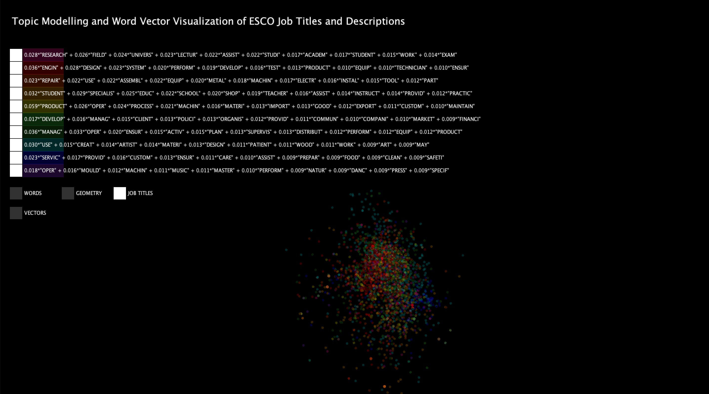
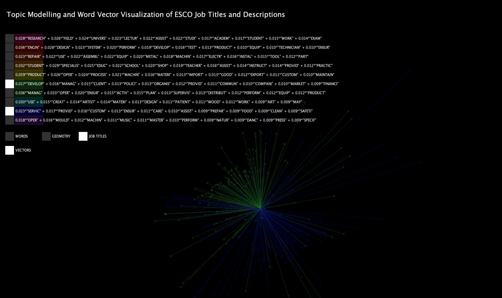
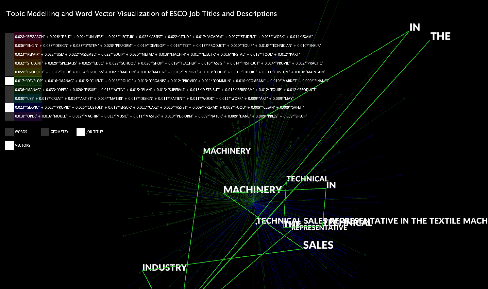
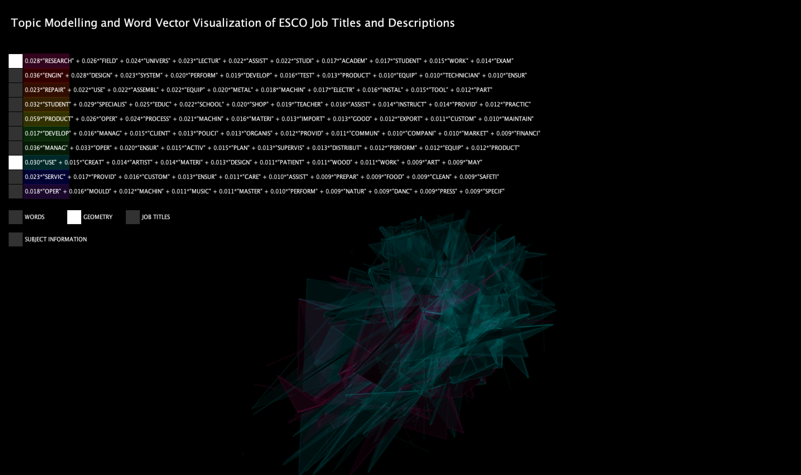
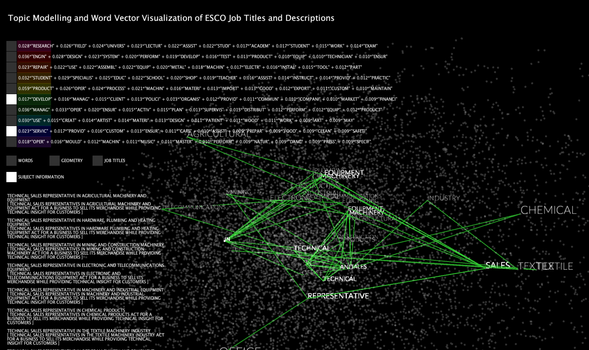

Nesta Data Science Challenge - Alternative Occupation Classification
===================================
This repository generates an alternative occupation classification using machine learning on 2,942 detailed occupations.

Process
---------
The fiction titles and subjects came from ESCO:

ESCO: [Job Title and Description Dataset](https://drive.google.com/file/d/16msIYPspUp2zrkgGJTdFQF8ZcxfEQbSy/view?usp=sharing)

The job titles and descriptions were analyzed using LDA from the gensim python library to create 10 topics:

Gensim: [LDA Model](https://radimrehurek.com/gensim/models/ldamodel.html)

The google news word vectors were used as a pregenerated Word2Vec model:

Google News Word Vectors: [Description](https://code.google.com/archive/p/word2vec/) 

Google News Word Vectors: [Download](https://github.com/mmihaltz/word2vec-GoogleNews-vectors)

I retrained the google news word vectors with the job descriptions using Gensim:

Gensim: [Word2Vec Model](https://radimrehurek.com/gensim/models/word2vec.html)

The resulting word vectors were brought down to three dimensions using t-SNE from the scikit learn python library:

Scikit-Learn: [t-SNE](https://scikit-learn.org/stable/modules/generated/sklearn.manifold.TSNE.html)

The visualisation tool was developed in Processing.org to show the job title vectors and word vectors, as well as the occupation class which has the highest topical coherence to the job description.

Processing: [Processing 3](https://processing.org/)

Installation
---------

To create and enter a virtual environment:

.. code-block:: python

    pipenv install --dev

To install the dependencies needed to run the processing pipeline:

.. code-block:: python

    pipenv install --dev

and to install the non-dev dependencies:

.. code-block:: python

    pipenv install

Running the processing pipeline
-----------------------------

The cli can be installed by installing the repository in editable model, with:

.. code-block:: bash

    pip install -e .

After this, you should be able to use the cli:

.. code-block:: bash

    nesta-job-analysis --help

An example of how to use the processing CLI command is:

.. code-block:: bash

    nesta-job-analysis preprocess data/occupations_en.csv

Analysis
----------------------

`preprosssing.py` takes the raw occupation data from `data/occupations_en.csv` and
removes the punctuation and extracts the words from each of the job descriptions.

`word_2_vec.py` uses a pregenerated training dataset of `x, y, z` coordinates fit
to words within Google News data, to generate "vectors" showing the semantic
similarity between words within a corpus. The `Word2Vec` model is fit to the `occupation_description` list.
Dimensionality reduction using `t-SNE` transforms the `x, y, z` to lie between 0 and 1.

`lda.py` First stopwords are removed and words are stemmed — words are reduced to
their root form. `lda.py` uses an unsupervised machine learning technique (Latent Dirlicht Allocation)
to define topical clusters which correspond to a set of documents within a corpora.
In this instance the corpora is the set of job titles, the document is an
individual job title and the topical clusters become the "occupation classification" (limited to 10).
LDA assumes each "occupation classification" is a mixture over an underlying set of
words used in "job titles", and each "job title" corresponds to a mixture of a "occupation classifications".

`postprocessing.py` refomats the LDA generated output. `processing_similiar_subjects.py`
uses data generated from a look up table in `visualisation.pde` to locates the
job title to its index within the `ArrayList<Integer>`.

Visualisation
---------

The analysis runs a pregenerated model (Word2Vec) on the job descriptions.
The job's location in the visualisation and path is based on the job title
instead of description. Both the size and the darkness of the title dot represents
how many jobs have the same description vector.

The results of the LDA and Word2Vec modelling are visualised using Processing.

All the topics visualized at once:

Two topics selected:

Selecting a single job title in "Title view":

"Geometry view" of two topics:

Selecting a word from the job descriptions in "word view" and viewing all job descriptions:

Interaction
---------
Each LDA defined occupation classification is given a separate colour which can be turned on and off.
The job can be viewed in Title Mode, where the vectors can be turned on and off.
The word cloud can be used to see words contained within jobs descriptions, the job description information is shown in a scrolling sidebar and can be turned on and off.
When a point is hovered over the words/job titles appear, the user can use the up and down arrow keys to cycle through the words/job titles.
The right and left arrow keys can be used to select a specific word/job title and see the connections related to it.
